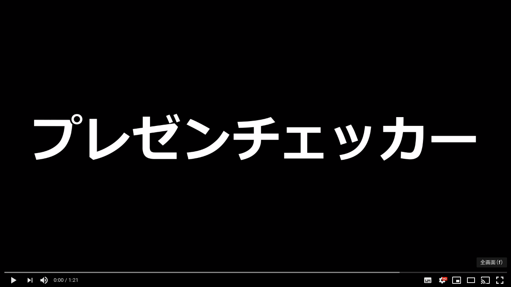

# プレゼンテーションチェッカー

## 製品概要
### プレゼンテーション x Tech

### 背景（製品開発のきっかけ、課題等）
プレゼンテーションにおいて**視線**や**声**は、重要なスキルである。  
これらのプレゼンテーションスキルを見える化したいと考えた。   
見える化することで、プレゼンテーションスキルの向上に繋がるため。

### 製品説明（具体的な製品の説明）
### 特長
#### 1. プレゼンテーションスキルを見える化できる
- 視線や声のスコアから、プレゼンテーションスキルの良し悪しがわかる。

#### 2. 視線推定技術(NEC遠隔視線推定API)を用いて、プレゼンターの視線を解析
- 下を見すぎていないか...視線（高さ）の平均
- 全体を見渡せているか...視線（左右）の平均と分散

#### 3. 音の波形から、プレゼンターの声を解析
- 声が小さすぎないか...声（大小）の平均
- 声に抑揚があるか.....声（高さ）の分散

### 使用方法
1. プレゼンテーションを撮影し、動画をアップロード

2. **視線**、**声**の観点から採点結果が表示される

3. プレゼンターの**視線**情報を合成した動画をダウンロードすることができる

### 解決出来ること
プレゼンテーションスキルの向上

## 開発内容・開発技術
### 活用した技術
#### API
* NEC遠隔視線推定API

#### フレームワーク・ライブラリ・モジュール
* Flask
* [requierments.txt](https://github.com/jphacks/FK_1906/blob/master/requierments.txt)

### 独自開発技術
#### 2日間で開発した独自の機能・技術（Hack Dayで開発したもの）
* 音の波形から声のデータを取得
* 視線データと声のデータからプレゼンテーションスキルを数値化
* 視線データを合成した動画の生成

#### Award Dayまでに追加した機能
- プレゼン動画の解析状況表示
- 結果表示画面のUIをより分かりやすく
- スコア算出時に機械学習を用いる

### Award Dayでのプレゼン動画
https://youtu.be/P8NDj8yGGQk
